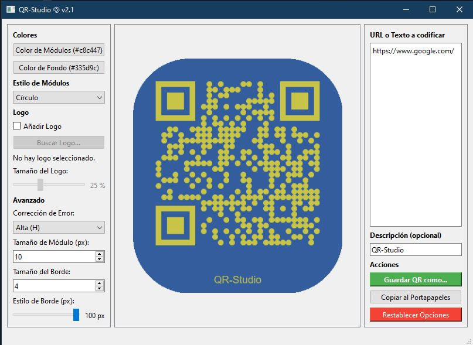

# 🎨 QR-Studio v2.1

¡Bienvenido a QR-Studio! Una aplicación de escritorio potente y fácil de usar para crear códigos QR totalmente personalizados.

Este proyecto convierte la simple tarea de generar un QR en un proceso de diseño creativo. Olvídate de los aburridos códigos en blanco y negro; con QR-Studio, puedes diseñar QRs que se alineen con tu marca, evento o estilo personal, todo a través de una interfaz visual con vista previa en tiempo real.



---

## ✨ Características Principales

* **Vista Previa en Tiempo Real:** Cada cambio que haces se actualiza al instante.
* **Personalización de Color:** Elige colores sólidos tanto para los módulos (el "relleno") como para el fondo.
* **Estilos de Módulos:** Cambia la forma de los "píxeles" de tu QR a:
    * Cuadrados (clásico)
    * Redondeados
    * Círculos
* **Logo Central:** Añade tu propio logo o imagen en el centro del QR.
* **Tamaño de Logo Ajustable:** Controla qué tan grande o pequeño es el logo con un simple slider.
* **Descripción de Texto:** Añade un título o descripción opcional que se imprime debajo del QR.
* **Bordes Redondeados:** Aplica un "border-radius" al lienzo completo para un acabado moderno.
* **Guardar y Copiar:** Guarda tu creación como `PNG` o `JPG`, o cópiala directamente al portapapeles.
* **Controles Avanzados:** Ajusta el nivel de corrección de errores, el tamaño del módulo y el grosor del borde.

---

## 🚀 Instalación y Puesta en Marcha

Sigue estos pasos para ejecutar QR-Studio en tu máquina local.

### 1. Obtener el Proyecto

Primero, clona este repositorio o descarga los archivos (`QR_Studio_(v2.1).py`, `requirements.txt`) en una carpeta en tu ordenador.

### 2. Crear un Entorno Virtual

Es una buena práctica usar un entorno virtual (`venv`) para aislar las dependencias de este proyecto.


# Navega hasta la carpeta del proyecto
```bash
cd /ruta/a/tu/proyecto/QR-Studio
```

# Crea el entorno virtual (puedes llamarlo 'env' o 'venv')
```bash
python -m venv env
```

### 3. Activar el Entorno
Antes de instalar nada, necesitas "activar" el entorno que acabas de crear.

En Windows (CMD / PowerShell):

```bash
.\env\Scripts\activate
```


### 4. Instalar las Dependencias
Con el entorno activado, usa pip para instalar todas las bibliotecas necesarias que están listadas en el archivo requirements.txt.

```bash
pip install -r requirements.txt
```


### 💻 Cómo Ejecutar el Programa
Una vez que las dependencias estén instaladas, ¡estás listo para lanzar la aplicación!

# Asegúrate de que tu entorno (env) sigue activo
```bash
python QR_Studio_(v2.1).py
```
